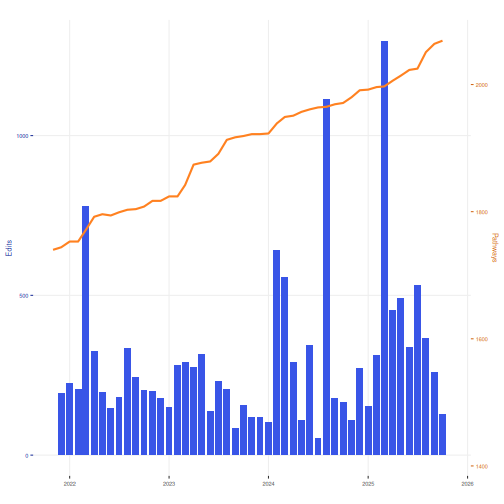

# WikiPathways Stats
This R notebooks prepares figures to summarize WikiPathways activity. The output files are displayed on the website and used in publications and grant applications. Please edit in coordination with the WikiPathways development team.

* Data points are collected in _*data/*
* Plots are saved in *assets/img/*
 


## Collect Data

### Initialize Pathway Count Table
Collect history from old webservice, using getPathwayHistory on "Approved" 
pathways and checking oldest revision on pathways after WP3959 against a 
cutoff "oldest.date". 

**This was used to populate the data table; only run once.** See GitHub 
Collections to update the table using data sourced from GitHub repos.


### Initialize Monthly Activity Table
Collect monthly edit history from "User edits in month" from old server at 
*wpi/statistics/editCounts.txt*, manually simplified to *editCounts.csv*.

**This was used to populate the data table; only run once.** See GitHub 
Collections to update the table using data sourced from GitHub repos.


### GitHub Collections


``` r
## read saved data
wpid.all.df.cnts <- read.csv("../_data/pathway_counts.csv", stringsAsFactors = F)
edits.user.df <- read.csv("../_data/edit_counts.csv", stringsAsFactors = F)
active.author.df.cnts <- read.csv("../_data/active_author_counts.csv", stringsAsFactors = F)

## add new row of data
# TODO: count WP folders in _pathways/
# TODO: commits per time frame, see https://git-scm.com/docs/git-rev-list with
# parms --since and --until
```

## Plot data

Composite plot for main page: pathway count and number of edits per month.

First, let's combine our data frames and make a proper date column and factor by 
month

``` r
combo.df <- edits.user.df %>%
  full_join(wpid.all.df.cnts, by="date") %>%
  dplyr::filter(!is.na(edits)) %>%
  arrange(date)

combo.df$date <- strptime(paste0(combo.df$date,"01"), "%Y%m%d")
combo.df$month <- factor(format(combo.df$date, "%B"),
                                levels = month.name)
```

Next, let's display the latest data points

``` r
tail(combo.df[,2:4],1)
```

```
##    edits pathways month
## 87   454     2006 April
```


``` r
# Calculate stats for data release: new pathways and active authors
last.two.pw.counts <- tail(wpid.all.df.cnts$pathways, 2)
# New pathways last month
new.pws <- (last.two.pw.counts[2] - last.two.pw.counts[1])

# Number of active authors in the last month
active.authors <- tail(active.author.df.cnts$authors, 1)
```

Next, let's plot a time series

``` r
# RColorBrewer::display.brewer.all()
bcols <- RColorBrewer::brewer.pal(3,"Set1")
acols <- bcols
bcols <- c("#FF8120","#3955E7")
acols <- c("#D16919","#1E3199")

# date range for x-axis
Ym.end <- wpid.all.df.cnts[nrow(wpid.all.df.cnts),1]+1 #inclusive of final month
Ym.start <- Ym.end - 400 # 4 years
  
# scaling for primary and secondary y-axes
ylim.prim <- c(0, max(combo.df$edits, na.rm = T)) # range for edits
ylim.sec <- c(min(combo.df$pathways, na.rm = T), max(combo.df$pathways, na.rm = T))    # range for pathways
b <- diff(ylim.prim)/diff(ylim.sec)
a <- b*(ylim.prim[1] - ylim.sec[1])

p <- ggplot(combo.df) +
  geom_bar(aes(x = as.Date(date),y=edits),stat="identity", fill=bcols[2]) +
  geom_line(data=na.omit(combo.df), 
            aes(x = as.Date(date),y=a + pathways * b), 
            color = bcols[1], size = 1) +
  scale_x_date(date_breaks = "1 year", date_labels = "%Y",
               name = "",
               limits = c(as.Date(strptime(paste0(Ym.start,"01"),"%Y%m%d")),as.Date(strptime(paste0(Ym.end,"01"),"%Y%m%d")))) +
  scale_y_continuous(name="Edits", 
                     limits = ylim.prim,
                     sec.axis=sec_axis(~ (. - a)/b, 
                                       name="Pathways")) +
  ggtitle("") +
  xlab("") +
  theme(axis.text.y.left=element_text(colour=acols[2]),
        axis.text.y.right=element_text(colour=acols[1]),
        axis.ticks.y.left=element_line(colour=acols[2]),
        axis.ticks.y.right=element_line(colour=acols[1]),
        axis.title.y.left = element_text(colour=acols[2]),
        axis.title.y.right = element_text(colour=acols[1]),
        text = element_text(size = 7),
        panel.grid.major = element_line(color="#eeeeee"), 
        panel.background = element_rect(fill='transparent'), #transparent panel bg
        plot.background = element_rect(fill='transparent', color=NA), #transparent plot bg
        panel.grid.minor = element_blank(), #remove minor gridlines
        legend.background = element_rect(fill='transparent'), #transparent legend bg
        legend.box.background = element_rect(fill='transparent') #transparent legend panel
)


p
```




``` r
ggsave("../assets/img/main_stats.png", plot = last_plot(), 
       width = 650, height = 450, units = "px", dpi = 250, bg='transparent')
```

Now, let's make pngs per month for animation!

``` r
# plot per month
for(i in seq(nrow(combo.df),1)){
  combo.df.anim<-combo.df[1:i,]
  
p <- ggplot(combo.df.anim) +
  geom_bar(aes(x = as.Date(date),y=edits),stat="identity", fill=bcols[2]) +
  geom_line(data=na.omit(combo.df.anim), 
            aes(x = as.Date(date),y=a + pathways * b), 
            color = bcols[1], size = 1) +
  scale_x_date(date_breaks = "1 year", date_labels = "%Y",
               name = "",
               limits = c(as.Date(strptime(paste0(Ym.start,"01"),"%Y%m%d")),as.Date(strptime(paste0(Ym.end,"01"),"%Y%m%d")))) +
  scale_y_continuous(name="Edits", 
                     limits = ylim.prim,
                     sec.axis=sec_axis(~ (. - a)/b, 
                                       name="Pathways")) +
  ggtitle("") +
  xlab("") +
  theme(axis.text.y.left=element_text(colour=acols[2]),
        axis.text.y.right=element_text(colour=acols[1]),
        axis.ticks.y.left=element_line(colour=acols[2]),
        axis.ticks.y.right=element_line(colour=acols[1]),
        axis.title.y.left = element_text(colour=acols[2]),
        axis.title.y.right = element_text(colour=acols[1]),
        text = element_text(size = 7),
        panel.grid.major = element_line(color="#eeeeee"), 
        panel.background = element_rect(fill='transparent'), #transparent panel bg
        plot.background = element_rect(fill='transparent', color=NA), #transparent plot bg
        panel.grid.minor = element_blank(), #remove minor gridlines
        legend.background = element_rect(fill='transparent'), #transparent legend bg
        legend.box.background = element_rect(fill='transparent') #transparent legend panel
)
  
  
  p
  
  ggsave(paste0("stats_files/main_stats_",str_pad(i, 3, pad = "0"),".png"), plot = last_plot(), 
       width = 650, height = 450, units = "px", dpi = 250)
}
```

```
## `geom_line()`: Each group consists of only one observation.
## ℹ Do you need to adjust the group aesthetic?
```

``` r
#make animated gif
anim.img.list <- list.files(path='stats_files', pattern = '*.png', full.names = TRUE) 
anim.img.list %>% 
  image_read() %>% # reads each path file
  image_join() %>% # joins image
  image_animate(delay=as.integer(3*100/nrow(combo.df)), #first number is total seconds for all frames to play
                loop = 1) %>% # number of repeat plays
  image_write("../assets/img/main_stats.gif") # write to current dir

anim.img.list %>% 
  image_read() %>% # reads each path file
  image_join() %>% # joins image
  image_animate(delay=as.integer(3*100/nrow(combo.df)), #first number is total seconds for all frames to play
                loop = 0) %>% # number of repeat plays
  image_write("../assets/img/main_stats_inf.gif") # write to current dir

#clean up
lapply(anim.img.list, function(fn){
  if (file.exists(fn))
    file.remove(fn)
})
```

